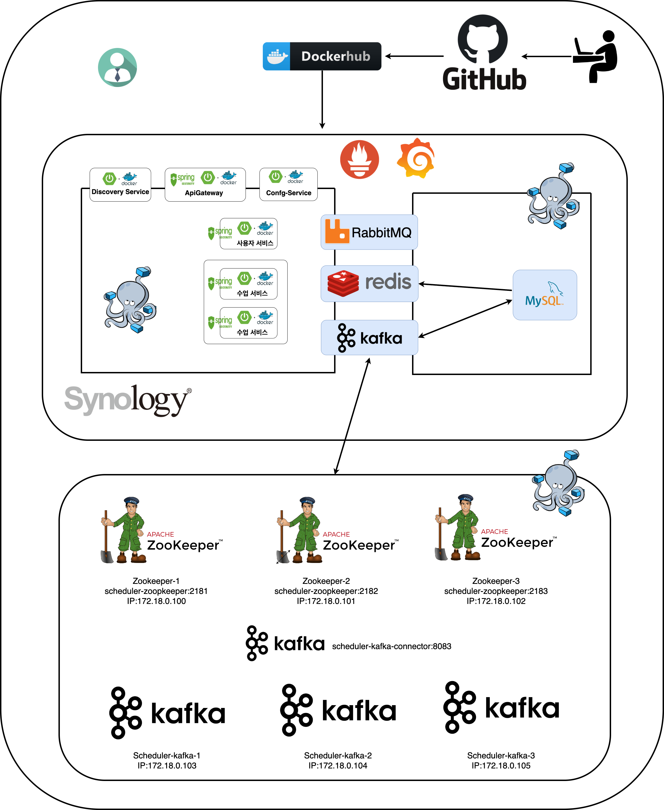

# 📅 Scheduler-MSA (1인 개발)

Synology NAS를 기반으로 교사와 학생의 수업을 예약하고 관리할 수 있는 수강 신청 어플리케이션입니다. 

  이 프로젝트는 1년전, **모놀리식**에서 시작하여 **마이크로서비스**(MSA)로 조금씩 전환되는 과정을 기록하고 있습니다. 각 기능은 독립적으로 배포되고 확장 가능한 구조로 재설계 되었으며, 주문 서비스를 제외한 각 서비스 API에 대하여 테스트 케이스가 작성되어 있습니다.

**🔗 모놀리식 버전 GitHub 저장소**: https://github.com/devhong96/scheduler

---
## 🚀 서비스 엔드포인트
- **Eureka 서버 (서비스 디스커버리)**  
  🔗 [Eureka Dashboard](https://seho0218.synology.me:8762/)  

- **Swagger 문서 (API 문서화)**  
  🔗 [Swagger UI](https://seho0218.synology.me:8087/swagger-ui/index.html)

 

---

## 🛠️ 트러블 슈팅

- [조회 성능(속도)에 따른 Redis와 인덱스 비교 분석](https://dev-hong96.tistory.com/141) 

- [MSA로 전환한 계기와 기준, 설계 방향](https://dev-hong96.tistory.com/134) 

- [[MSA] 각 서비스간의 인증과 보안( 비밀번호 : 4zMDQ4Nj )](https://dev-hong96.tistory.com/135) 

- [[MSA] 데이터 조회(테스트 코드 포함)](https://dev-hong96.tistory.com/136) 

- [[MSA] 컨테이너 실행 순서](https://dev-hong96.tistory.com/137) 

- [[MSA] 데이터 정합성과 멱등성](https://dev-hong96.tistory.com/138) 

    
   

---
## 🏗️ 설계 특징

#### **사용자 관리 (Member Management)**

- **회원 가입 및 인증**: 이메일 인증을 통해 안전한 회원가입 절차와 비밀번호 찾기 기능을 제공

- **교사 등록 승인**: 관리자가 교사의 회원 가입 요청을 검토하고 승인

- **학생 등록 승인**: 교사는 학생의 회원가입을 승인

#### **수업 및 스케줄 관리 (Course & Schedule Management)**

- **스케줄 설정**: **교사**가 수업을 진행할 수 있는 날짜와 시간을 자유롭게 등록하고 관리

- **수강 신청**: **학생**이 교사가 등록한 스케줄을 확인하고 실시간으로 수강을 신청

#### **결제 및 시스템 (Payment & System)**

- **온라인 결제**: 카카오, 네이버, 나이스페이 등 다양한 PG사와 연동하여 편리한 결제 기능을 제공

- **안정적인 예약 처리**: **Redisson 분산 락**을 통해 동시성 문제 해결

- **신뢰성 있는 데이터 처리**: Kafka와 RabbitMQ 기반의 비동기 이벤트를 통해 결제, 예약 등의 데이터를 안정적으로 처리

---
### 🛠️ 기술 스택 (Tech Stack)

| 구분             | 기술                                                                     |
| :------------- | :--------------------------------------------------------------------- |
| **Backend**    | Java 17, Spring Boot 3, JPA, QueryDSL, Spring Security 6, JWT          |
| **MQ**         | Kafka (3.8.x), RabbitMQ                                                |
| **Cloud**      | Spring Cloud 4.x (Eureka, Config, Gateway, BootStrap, CircuitBreaker)  |
| **Database**   | MySQL 8.0, Redis                                                       |
| **DevOps**     | Docker, Docker-Compose, GitHub Actions, Docker Hub, Synology NAS (DSM) |
| **Monitoring** | Prometheus, Grafana, Spring Boot Actuator                              |
### 🖥️ Infrastructure
- **Synology NAS** (개인 서버 기반 MSA 환경 구축)
  -  Hardware : Synology 920+ 
     - CPU: intel CeleronJ4125 (4C 4T, Base 2.0GHz, Boost 2.70 GHz)
     - RAM : 20GB(4 + 16)
  - 네트워크 : 가정용 네트워크 500Mbps (공유기 : iptime a5004ns)

---
## ⚙️ Scheduler-MSA Architecture Diagram

  
  

---
## 📌 Git 저장소 목록

### 🛠️ Infra

- **Discovery Service** (서비스 디스커버리) 🔗 [GitHub Repository](https://github.com/devhong96/scheduler-discovery-service)

- **Config Service** (환경 설정 관리)  
  🔒 *이 저장소는 비공개입니다.*

- **Config** (환경 설정)  
  🔒 *이 저장소는 비공개입니다.*
---
### 🚀 Application Services Repository

- **API Gateway Service** Spring Cloud Gateway 기반 🔗 [GitHub Repository](https://github.com/devhong96/scheduler-apigateway-service)
 

- **Member Service** 사용자 계정, 인증 및 권한 관리 🔗 [GitHub Repository](https://github.com/devhong96/scheduler-member-service)

- **Course Service** 수업 일정 생성 및 관리 🔗 [GitHub Repository](https://github.com/devhong96/scheduler-course-service)

- **Article Service**(개발 중) 문의사항 및 게시판 관리. 🔗 [GitHub Repository](https://github.com/devhong96/scheduler-article-service)

- **Order Service** Kakao, Naver, NicePay와 연동된 결제 처리 🔗 [GitHub Repository](https://github.com/devhong96/scheduler-order-service)

---
## 📚 참고한 강의

🔗 [김영한의 스프링 로드맵](https://www.inflearn.com/roadmaps/373)

🔗 [김영한의 스프링 부트와 JPA 실무 완전 정복 로드맵](https://www.inflearn.com/roadmaps/149)

🔗 [Spring Cloud로 개발하는 마이크로서비스 애플리케이션(MSA)](https://www.inflearn.com/course/%EC%8A%A4%ED%94%84%EB%A7%81-%ED%81%B4%EB%9D%BC%EC%9A%B0%EB%93%9C-%EB%A7%88%EC%9D%B4%ED%81%AC%EB%A1%9C%EC%84%9C%EB%B9%84%EC%8A%A4)

🔗 [스프링부트로 직접 만들면서 배우는 대규모 시스템 설계 - 게시판](https://www.inflearn.com/course/%EC%8A%A4%ED%94%84%EB%A7%81%EB%B6%80%ED%8A%B8%EB%A1%9C-%EB%8C%80%EA%B7%9C%EB%AA%A8-%EC%8B%9C%EC%8A%A4%ED%85%9C%EC%84%A4%EA%B3%84-%EA%B2%8C%EC%8B%9C%ED%8C%90)

🔗 [대규모 트래픽 처리를 위한 부하테스트 입문/실전](https://www.inflearn.com/course/%EB%8C%80%EA%B7%9C%EB%AA%A8%ED%8A%B8%EB%9E%98%ED%94%BD-%EB%B6%80%ED%95%98%ED%85%8C%EC%8A%A4%ED%8A%B8-%EC%9E%85%EB%AC%B8-%EC%8B%A4%EC%A0%84)

